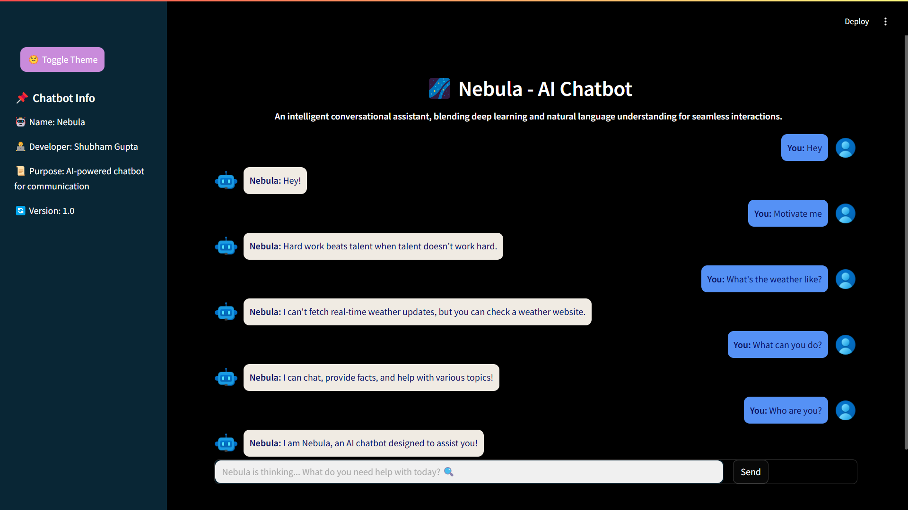

# Nebula-Chatbot
🌌 Nebula-Chatbot - An AI-powered chatbot using NLP for intent recognition, entity extraction, and smart responses. Built with Python, Logistic Regression, and NLP libraries for seamless interaction. 🚀

  

## 🚀 Overview  
Nebula is an AI-driven chatbot designed for seamless and intelligent conversations. Leveraging **Natural Language Processing (NLP)**, it understands user inputs, provides meaningful responses, and adapts dynamically.  

---

## 🔥 **Key Features**  
- 💬 **Conversational AI** - Handles diverse queries with NLP-based understanding.  
- 🎨 **Dynamic Theme Switching** - Toggle between **Light** and **Dark** mode effortlessly.  
- 📚 **Jupyter Notebook Intent Loading** - Loads chatbot intents dynamically from `.ipynb` files.  
- 🔄 **Persistent Chat History** - Keeps track of user interactions.  
- 🧠 **WordNet Lemmatization** - Enhances text processing accuracy.  
- ⚡ **Optimized UI** - Modern, WhatsApp-style chat interface for an intuitive experience.  

---

## 🛠️ **Improvements & Enhancements**  
This project has undergone several **improvements** to enhance its performance and usability:  

### ✅ **1. Advanced Theme Management**  
- Fixed **theme persistence** issue and enabled **seamless switching**.  
- Sidebar now adapts to **dark/light mode** dynamically.  

### ✅ **2. Enhanced NLP Processing**  
- Implemented **WordNet lemmatization** to improve text matching accuracy.  
- Optimized **intent recognition** by replacing regex with **efficient substring matching**.  

### ✅ **3. Streamlit UI & UX Enhancements**  
- **Revised chatbot layout** to align with a **WhatsApp-style** message format.  
- **Sidebar information redesigned** for **modern & clean aesthetics**.  

### ✅ **4. Intelligent Intent Loading**  
- Chatbot **dynamically loads intents** from a Jupyter Notebook (`.ipynb` file).  
- Added **error handling** to prevent crashes if the file is missing.  

---

## 🏗 **Installation & Setup**  

### **1️⃣ Clone the Repository**  
```bash
git clone https://github.com/its-shubham15m/Nebula-Chatbot.git
cd Nebula-Chatbot
streamlit run app.py

