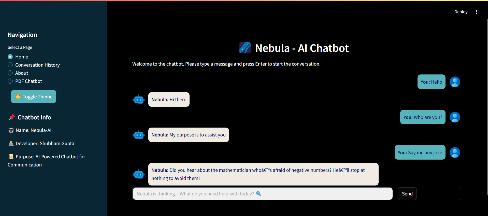

# Nebula - AI Chatbot

Nebula is an AI-powered chatbot built with Streamlit, NLP techniques, and machine learning models. It provides intelligent conversations and a seamless user experience through a responsive chat interface.




## Features
- **Natural Language Processing (NLP)**: Uses TF-IDF vectorization and Logistic Regression for intent recognition.
- **Chat UI**: Clean and modern design with a toggleable dark/light theme.
- **PDF Chatbot Integration**: Allows users to interact with uploaded PDFs using context-aware responses based on N-Grams and TF-IDF similarity.
- **Conversation Logging**: Stores chat history in a CSV file for future analysis.
- **User-Friendly UI**: Developed using Streamlit for a smooth and interactive experience.

## Technologies Used
- **Python**
- **Streamlit** (UI Framework)
- **Scikit-learn** (Machine Learning Models)
- **NLTK** (Natural Language Processing)
- **TF-IDF Vectorization**
- **PyPDF2** (PDF Processing)

## Installation
### Prerequisites
Ensure you have Python 3.12+ installed.

### Steps
1. Clone this repository:
   ```bash
   git clone https://github.com/its-shubham15m/Nebula-Chatbot.git
   cd Nebula-Chatbot
   ```
2. Install the required dependencies:
   ```bash
   pip install -r requirements.txt
   ```
3. Run the chatbot:
   ```bash
   streamlit run chatbot.py
   ```
4. Run the PDF chatbot (if needed):
   ```bash
   streamlit run pdfchat.py
   ```

## Usage
### Chatbot Interface
- Run `chatbot.py` to launch the chatbot.
- Type messages and receive AI-generated responses.
- Theme toggle available for light and dark modes.
- Chat history is stored in `chat_log.csv`.

### PDF Chatbot
- Run `pdfchat.py` to interact with PDF files.
- Upload a PDF and ask questions about its content.
- Uses TF-IDF and n-gram context-aware response generation.

## Contribution
Contributions are welcome! Feel free to fork the repository and submit pull requests.

## Author
Developed by **Shubham Gupta**.

## License
This project is licensed under the MIT License. See `LICENSE` for details.

